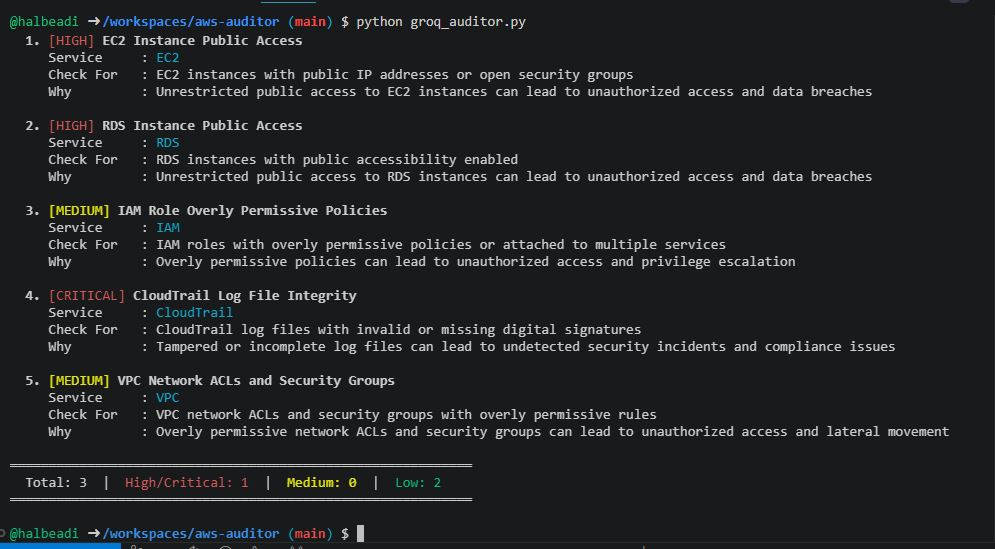

# aws-auditor

AWS misconfigurations are a leading cause of cloud security breaches.

This project is an automated AWS security auditing tool that detects critical misconfigurations across services like IAM, S3, EC2, and CloudTrail, and enhances analysis using LLM-based intelligence to provide risk scoring and remediation guidance.

---

## 🚀 What It Does

Scans your AWS account across 4 security domains:

| Check | What it looks for | Severity |
| --- | --- | --- |
| **IAM** | Root MFA, user MFA, old access keys | HIGH/MEDIUM |
| **S3** | Public buckets, missing versioning | HIGH/LOW |
| **CloudTrail** | Logging disabled, missing validation | HIGH/MEDIUM |
| **Security Groups** | Dangerous ports open to 0.0.0.0/0 | HIGH |

---

## 🤖 AI-Powered Auditor (Groq + Llama 3)

`groq_auditor.py` extends the base auditor with a Groq LLM integration — findings are fed to Llama 3 for intelligent analysis.

---

### How it works
Phase 1 → Runs all AWS security checks (IAM, S3, CloudTrail, SGs)
Phase 2 → Sends findings to Llama 3 via Groq API
Phase 3 → AI returns risk scores, remediations, and suggested new checks
Phase 4 → Prints AI-enhanced report (optionally saves JSON)

---

### AI Report includes

- **Risk score (1–10)** for each finding
- **AI-reassessed severity** (LOW / MEDIUM / HIGH / CRITICAL)
- **Step-by-step remediation** per finding
- **5 dynamically suggested additional checks**
- **Executive summary** of overall security posture

### Usage

```bash
export GROQ_API_KEY="your_key_here"
python groq_auditor.py                        # run all checks
python groq_auditor.py --checks iam sg        # specific checks
python groq_auditor.py --output report.json   # save full JSON report
```

### Additional requirement

```bash
pip install groq colorama
```

---

## 📸 Sample Output

<p align="center">
  
</p>

Real execution output showing AI-enhanced detection of critical AWS misconfigurations including EC2 public exposure, RDS risks, and CloudTrail integrity issues.

## 🛠️ Tech Stack

| Component | Technology |
| --- | --- |
| Core language | Python 3 |
| AWS SDK | boto3 |
| AI/LLM | Groq API + Llama 3 (llama-3.3-70b-versatile) |
| Terminal output | colorama |

---

## 🏗️ Project Structure
aws-auditor/
├── scanner/
│   ├── iam_check.py          # IAM misconfigurations
│   ├── s3_check.py           # S3 bucket security
│   ├── cloudtrail_check.py   # Audit logging checks
│   ├── sg_check.py           # Security group checks
│   └── reporter.py           # Terminal + JSON output
├── main.py                   # Base CLI auditor
├── groq_auditor.py           # AI-powered Groq + Llama 3 auditor
├── requirements.txt
└── README.md

---

## ⚙️ Installation

```bash
git clone https://github.com/halbeadi/aws-auditor.git
cd aws-auditor
pip install -r requirements.txt
pip install groq
```

Configure AWS credentials:

```bash
aws configure
```

---

## 💻 Usage

**Base auditor:**
```bash
python main.py
python main.py --checks iam sg
python main.py --output report.json
```

**AI-powered auditor:**
```bash
export GROQ_API_KEY="your_key_here"
python groq_auditor.py
python groq_auditor.py --checks iam s3
python groq_auditor.py --output ai_report.json
```

---

## 🧪 Real World Results

Tested against a live AWS account and found:

- SSH port 22 open to `0.0.0.0/0` on a production EC2 instance **(HIGH — risk score 9/10)**
- IAM user missing MFA **(MEDIUM — risk score 7/10)**
- S3 versioning disabled on CloudTrail buckets **(LOW)**
- AI suggested 5 additional checks including RDS public access, CloudTrail log integrity, and VPC ACL review

---

## 🔒 Security Notes

- **Read-only by design** — uses `SecurityAudit` policy, cannot modify resources
- **No credentials in code** — uses `aws configure` / environment variables only
- **API key via environment variable** — never hardcoded

---

## ⚠️ Legal Disclaimer

Only run against AWS accounts you own or have explicit permission to audit.

---

## 👤 Author

**Aditya Halbe** — Cloud & DevSecOps Engineer | CEH Certified
[GitHub](https://github.com/halbeadi) · [LinkedIn](https://linkedin.com/in/aditya-halbe) · [pyshala.in](https://pyshala.in)
